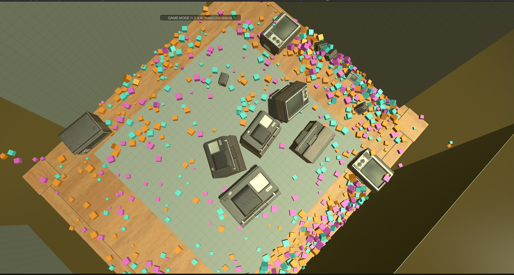

# Interactive Physics Sandbox

Work in progress

Unity interactive physics sandbox.

Focus: Rigid bodies

Interaction modes:
1. Cubes management
    * Spray from camera
    * Spray from raycast hit
    * Spawning as explosion
    * Grow/shrink
    * Destory
2. Force interaction
    * Push/pull from camera
    * Push/pull from raycast hit
    * Push pull from a point in space
    * Change gravity
3. Instancing prefabs
    * Preview
    * Transformations (scaling, rotation, translation)
4. Building environment
    * Walls

